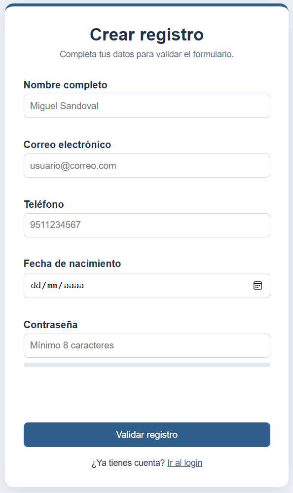
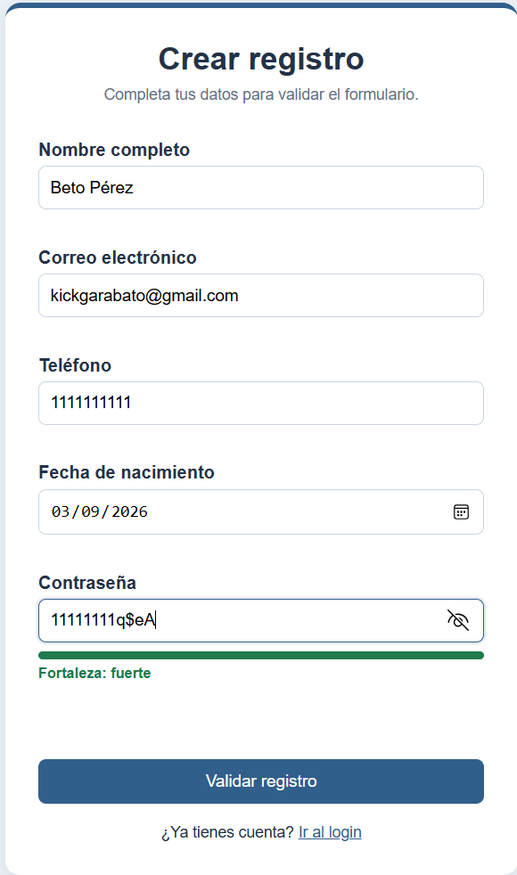
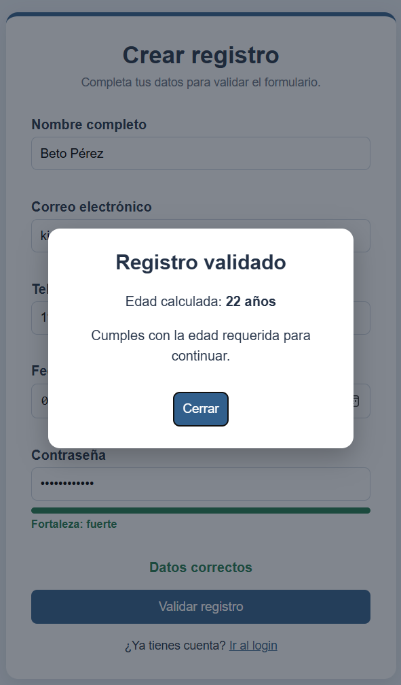
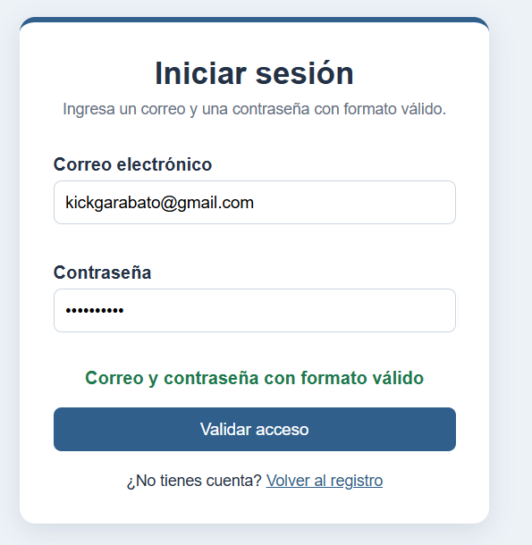
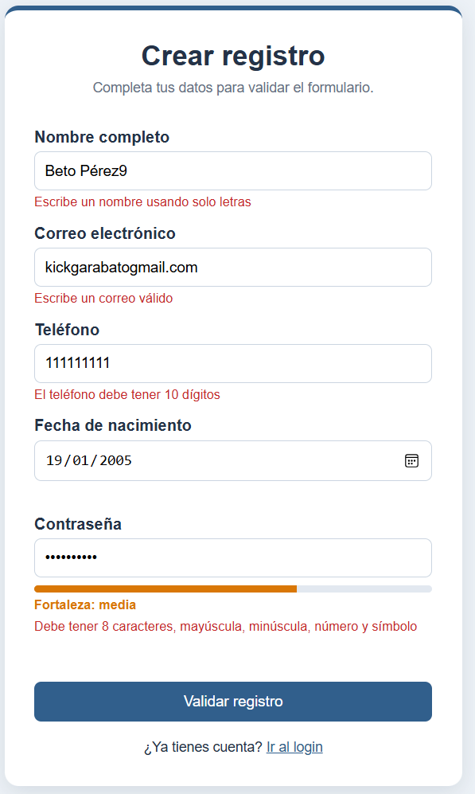
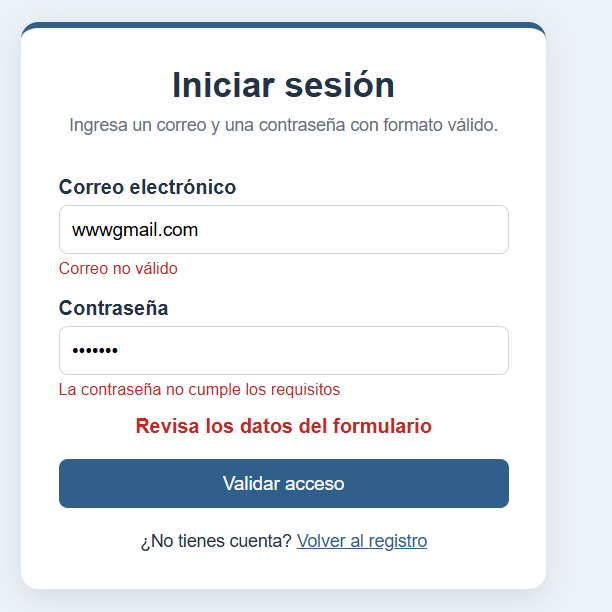

# Actividad 2 - Librería utileria.js

**Nombre:** Sandoval Reyes Miguel  
**Materia:** Programación Web  
**Actividad:** Librería de utilidades en JavaScript

## Descripción

Este proyecto contiene una librería en JavaScript puro para reutilizar validaciones comunes en formularios. La librería permite validar correos, nombres, longitudes, fechas de nacimiento y contraseñas. También incluye dos funciones adicionales para validar teléfonos y medir la fortaleza de una contraseña.

El proyecto utiliza la librería en un formulario de registro, una ventana modal para mostrar la edad calculada y una página `login.html`.

## Instalación

La librería se carga antes del archivo JavaScript propio de cada página:

```html
<script src="js/utileria.js"></script>
```

En el formulario principal también se carga:

```html
<script src="js/index.js" defer></script>
```

En el login se utiliza:

```html
<script src="js/login.js" defer></script>
```

## Funciones obligatorias

### validarCorreo(correo)

Valida que el texto tenga un formato básico de correo electrónico.

```javascript
validarCorreo("usuario@gmail.com");
```

### soloLetras(texto)

Valida que el texto contenga únicamente letras, espacios, acentos y la letra ñ.

```javascript
soloLetras("Miguel Sandoval");
```

### validarLongitud(numero, maxLongitud)

Comprueba que el valor no supere la longitud máxima indicada.

```javascript
validarLongitud("9511234567", 10);
```

### calcularEdad(fechaNacimiento)

Calcula la edad actual de una persona a partir de su fecha de nacimiento.

```javascript
calcularEdad("2004-05-20");
```

### esMayorDeEdad(fechaNacimiento)

Devuelve `true` cuando la persona tiene 18 años o más y `false` cuando es menor.

```javascript
esMayorDeEdad("2004-05-20");
```

### validarPassword(password)

Valida que la contraseña tenga mínimo 8 caracteres, una mayúscula, una minúscula, un número y un carácter especial.

```javascript
validarPassword("Prueba123!");
```

## Funciones adicionales

### validarTelefono(telefono)

Comprueba que el teléfono tenga exactamente 10 dígitos.

```javascript
validarTelefono("9511234567");
```

### medirFortalezaPassword(password)

Mide cuántas reglas cumple una contraseña y devuelve `débil`, `media` o `fuerte`.

```javascript
medirFortalezaPassword("Prueba123!");
```

## Integración

El archivo `index.html` usa las funciones de la librería para validar nombre, correo, teléfono, fecha de nacimiento y contraseña.

Si todos los campos tienen un formato correcto, se calcula la edad y se abre una ventana modal. Si la persona tiene 18 años o más, se indica que puede continuar. Si es menor de edad, el modal muestra la edad calculada y señala que el acceso está restringido.

El archivo `login.html` utiliza `validarCorreo()` y `validarPassword()` para comprobar el formato de los datos ingresados.

## Estructura del proyecto

```text
Actividad2/
├── README.md
├── index.html
├── login.html
├── css/
│   └── styles.css
├── js/
│   ├── utileria.js
│   ├── index.js
│   └── login.js
└── img/
```

## Capturas

### Formulario de registro

Vista inicial del formulario de registro con los campos de nombre, correo electrónico, teléfono, fecha de nacimiento y contraseña.



### Contraseña válida y fortaleza

Ejemplo del formulario con una contraseña que cumple los requisitos. La aplicación muestra su nivel de fortaleza como **fuerte**.



### Modal de registro validado

Cuando los datos son correctos y la persona cumple con la edad requerida, se muestra una ventana modal con la edad calculada y el resultado de la validación.



### Login con datos válidos

Ejemplo de `login.html` con un correo y una contraseña que cumplen con el formato solicitado.



### Validaciones del formulario

Ejemplo de las validaciones mostradas directamente en el formulario cuando el nombre, correo, teléfono o contraseña no cumplen con los requisitos.



### Login con datos inválidos

Ejemplo del login mostrando los mensajes correspondientes cuando el correo y la contraseña tienen un formato incorrecto.



## Video

Video demostrativo del funcionamiento de la librería y sus validaciones:

https://youtu.be/QHYWzwfksAY

## Repositorio

https://github.com/miguelsandovalreyeskgll/Actividad2

## GitHub Pages

https://miguelsandovalreyeskgll.github.io/Actividad2/
